# Docker Donegal - Ninjas Belt 
### Docker DOJO (Where ninja are born!) 
Pipeline - Happy Path :)
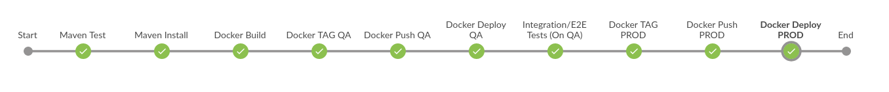


## Fork our project to your github accout

Go to https://github.com/dockerdonegal/ci-cd-dojo and click on the **Fork** button in the top right corner. 

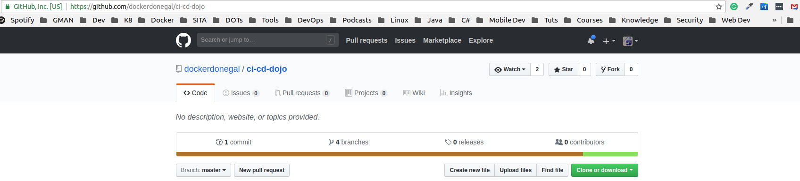

This will take only a few seconds, browser response "Forking dockerdonegal/ci-cd-dojo". 
Now you should have our project in your own repo. From now on we will be using your newly forked project. 
Forking Enjoy ;)

https://github.com/{{your-repo-username}}/ci-cd-dojo
## Clone your project
```
# Clone your project down to your dev machine
git clone git@github.com:Gmanweb/ci-cd-dojo.git

# change into the following directory
cd ci-cd-dojo/devops/

# list repo branches
git branch -a

# Checkout develope branch
git checkout develop
```

## Build your docker image
To build your jenkins image, run the following command replacing ` {{dockerhub-username}}` with your DockerHub username.
```
# Sample 
docker build --no-cache --file ./jenkins/Dockerfile -t {{dockerhub-username}}/dd-jenkins:latest ./jenkins
# Example
docker build --no-cache --file ./jenkins/Dockerfile -t gmanweb/dd-jenkins:latest ./jenkins
```
Terminal Response
```
Sending build context to Docker daemon   2.56kB
Step 1/9 : FROM jenkins/jenkins:2.127-alpine
2.127-alpine: Pulling from jenkins/jenkins
ff3a5c916c92: Already exists 
a8906544047d: Pull complete
... 
...
Successfully built 5f8c98ab3d70
Successfully tagged gmanweb/dd-jenkins:latest

```
## Login into Docker
Run `docker login` from the terminal, you will be promted for your username and password.
Example:
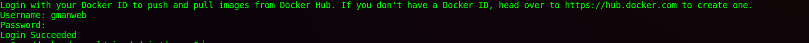

## Push to DockerHub
```
# Sample 
docker push {{dockerhub-username}}/dd-jenkins:latest
# Example
docker push gmanweb/dd-jenkins:latest
```

docker push gmanweb/dd-jenkins:latest
```
The push refers to repository [docker.io/gmanweb/dd-jenkins]
b9d438413ac4: Pushing [========================================>          ]   93.9MB/117.2MB
...
...
cd7100a72410: Layer already exists 
latest: digest: sha256:d1ddc99d5d9c357906be4ba962ae15f0f02702e50d3e779e380819cfe9cc5361 size: 4081

```

## Initialize a swarm
```
docker swarm init
```

## Create Network

> **Prerequisites:**

> - Firewall rules for Docker daemons using overlay networks

> You need the following ports open to traffic to and from each Docker host participating on an overlay network:

> 
> - TCP port 2377 for cluster management communications
- TCP and UDP port 7946 for communication among nodes
- UDP port 4789 for overlay network traffic

>Before you can create an overlay network, you need to either initialize your Docker daemon as a swarm manager using docker swarm init or join it to an existing swarm using docker swarm join. Either of these creates the default ingress overlay network which is used by swarm services by default. You need to do this even if you never plan to use swarm services. Afterward, you can create additional user-defined overlay networks


To create an overlay network which can be used by swarm services or standalone containers to communicate with other standalone containers running on other Docker daemons, add the --attachable flag:
```
docker network create --driver overlay --attachable --subnet=10.0.0.0/16 dd-network
```
You can specify the IP address range, subnet, gateway, and other options. See docker network create --help for details.


## Pull the images
Pull the image associated with your service defined in your docker-compose.yml
```
docker-compose pull
```

## Deploy stack
Run the following command to deploy your stack. 
```
docker stack deploy --compose-file docker-compose.yml ddninja
```
Terminal Response
```
Creating service ddninja_jenkins
```
TODO: Image in Compose FIle

### Check services
docker service ls
```
ID                  NAME                MODE                REPLICAS            IMAGE                      PORTS
gkykm51ddsqo        ddninja_jenkins     replicated          1/1                 javapi/dd-jenkins:latest   *:8080->8080/tcp
```

### Jenkins logs
Open a seperate terminal/cmd and run the following command to tail jenkins container logs
```
docker logs ddninja_jenkins.1.xxxxxxxxxxxxxxxxxx -f
```

## Configure your Jenkins Server
Open your browser at `http://127.0.0.1:8080/`

### Add Credential
We will be adding your **DockerHub** and **GitHub** login details to jenkins.
> NOTE: Very Important when adding your credentials to use the following **IDs**
> github = githubid
> dockerhub = dockerhubid

From the screen presented, click on Credential -> global -> add credentails. 
We will be adding your credentials for (github, dockerhub)

**Credentials:**

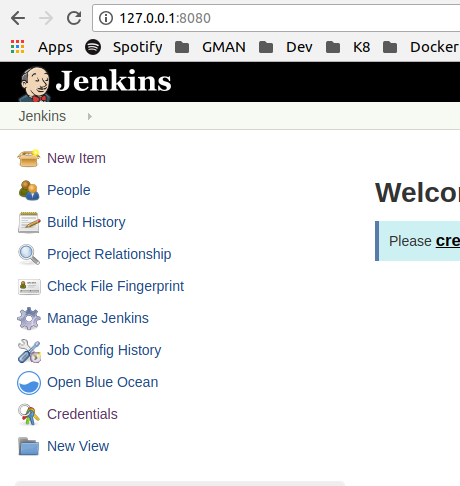

**Global:**

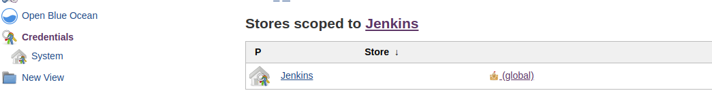

**Add credentails:**

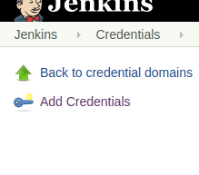

**Github credentails:**

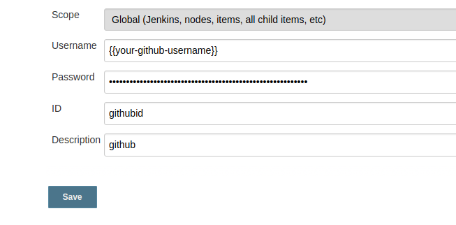

**Dockerhub credentails:**

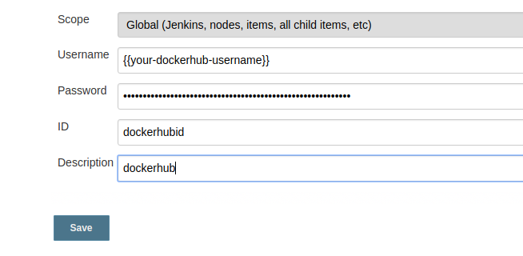

**Your 2 (dockerhub, Github) credentails:**
Remember the ID for each is important.

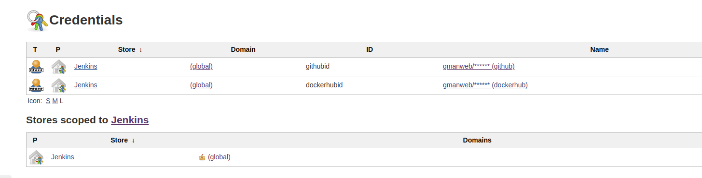

### Create your pipeline JOB
Now we can create our first pipeline job.

### Run your JOB

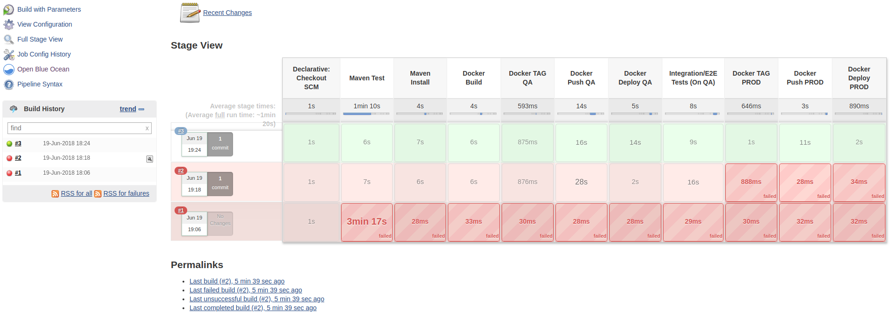

## Test 1
```
   jenkins: image: 
```

## Test 2
change the jenkinsfile to your dockerhub

## Clean up - Delete Stack
```
docker stack rm $(docker stack ls --format '{{.Name}}')
docker container prune -f

# If there's any incorrect behaviour related to an image (volumes)
docker system prune --volumes
# Remove QA and PROD Containers
docker container rm -f ninja-belt-prod ninja-belt-qa
```


```
mongo --host=ninja.dockerdonegal.ie:27017 -u ninja -p ninja ninja
```


```
POST: http://localhost:8080/ninja/save

```


```
{
	"name": "Romero",
	"belt": {
		"color": "white"
	},
	"dojo": {
		"name": "Donegal"
	}
}
```

```
{
   	"name": "Gearoid",
   	"belt": {
   		"color": "white"
   	},
   	"dojo": {
   		"name": "Dublin"
   	}
}
```
```
git flow init //accept defaults
git flow feature start add-unit-tests
git branch // to check which branch you are in

```

Follow documentation of jenkins (pipelines) at https://jenkins.io/doc/book/pipeline/docker/

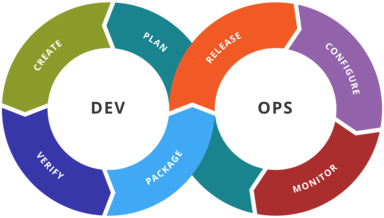
